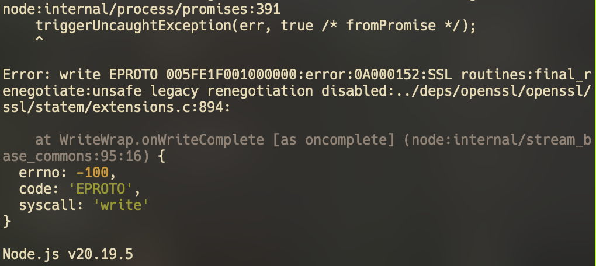
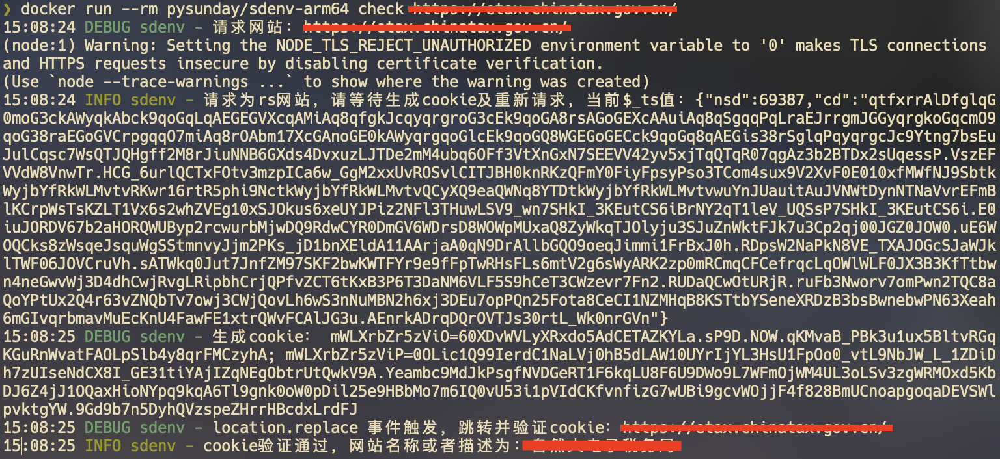
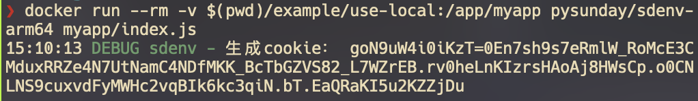
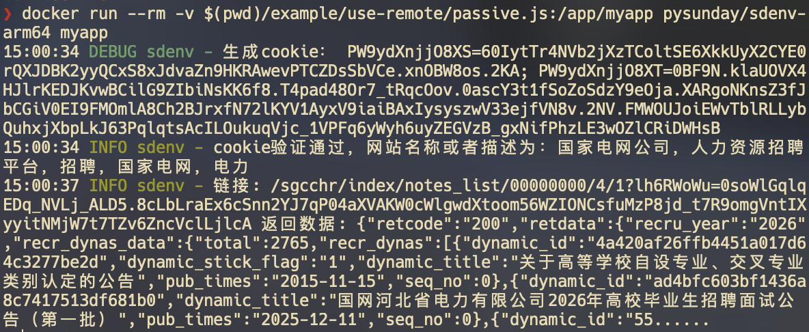
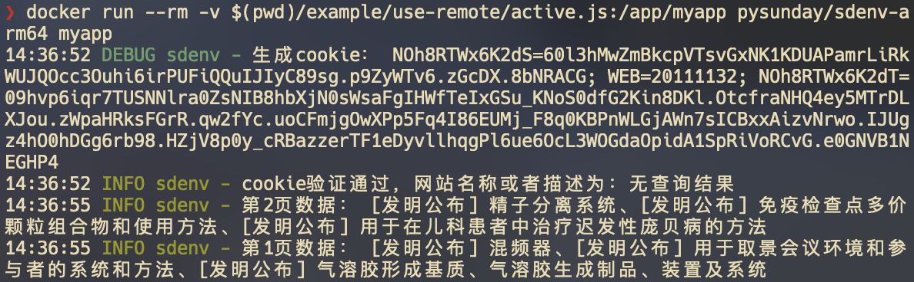

**开源兄弟项目(瑞数纯算逆向rs-reverse)：[rs-reverse](https://github.com/pysunday/rs-reverse)**

> [!WARNING]
> [免责声明](./DISCLAIMER.md)

> [!TIP]
> 💬 为了让交流更顺畅，推荐使用[GitHub Discussions](https://github.com/pysunday/sdenv/discussions)（私发微信消息可能不回，沟通建议优先Discussions + 交流群）：  
> 🙏 [提问/求助](https://github.com/pysunday/sdenv/discussions/categories/q-a)  
> 🙌 [分享经验或技巧](https://github.com/pysunday/sdenv/discussions/categories/show-and-tell)  
> 💬 [功能建议](https://github.com/pysunday/sdenv/discussions/categories/general)  
> 💡 [讨论新想法](https://github.com/pysunday/sdenv/discussions/categories/ideas)  
> 📚 [查阅已有讨论和答案](https://github.com/pysunday/sdenv/discussions)

<h1 align="center">
    <br>
    sdenv
</h1>

[](http://badge.fury.io/js/sdenv)

sdenv是一个javascript运行时补环境框架，与github上其它补环境框架存在较大区别，sdenv是站在巨人的肩膀上实现的，依赖于jsdom的强大dom仿真能力，sdenv可以真实模拟浏览器执行环境，作者在固定随机数与添加[sdenv-extend](https://github.com/pysunday/sdenv-extend)的部分插件后可以达到**瑞数vmp代码在sdenv运行生成的cookie值与浏览器生成的cookie值一致**。

* sdenv专用jsdom版本：[sdenv-jsdom](https://github.com/pysunday/sdenv-jsdom)
* sdenv多端环境提取：[sdenv-extend](https://github.com/pysunday/sdenv-extend)

## 依赖

作者开发时使用的是`v20.19.5`版本Node，由于jsdom27版本需要Node支持ESM，但是v20仅部分支持ESM，因此如果您也使用v20版本，请使用最新的，如当前最新为`v20.19.5`

编译node插件用的是[node-gyp](https://github.com/nodejs/node-gyp)工具，该工具需要有python环境和c环境(如windows系统需安装Visual Studio，Mac系统需要安装XCode)，请根据[工具文档](https://github.com/nodejs/node-gyp)进行系统环境搭建。

**需要注意windows中安装Visual Studio时需要勾选`使用C++的桌面开发`选项**


## 可能出现的问题

1. npm安装node-gyp报错：请确保操作系统有c++编译环境与python环境，报错示例（感谢用户风流小混沌提供报错图片）:

2. 安装缓慢及canvas报错(**基本都是网络问题**)：由于canvas安装会优先从github获取现成的包，因此请在安装前先设置代理或者其它国内源，如果安装仍然失败请使用npm官方源+代理方式重新尝试；
3. 旧式TLS Renegotiation不支持报错（目标网站服务器使用旧版OpenSSL，新版node不支持），这个报错纯node层无法解决，需使用抓包工具中转，调用命令时设置环境变量proxy的值，mac命令如`proxy=http://127.0.0.1:8888 node example/use-check/index.js 目标网站`，docker命令如：` docker run -e proxy=http://host.docker.internal:8888 --rm pysunday/sdenv-arm64 check 目标网站`


注意：canvas安装失败不会中断安装，但是在运行时，如果网页代码中有调用canvas相关API会报错，如有使用canvas相关api请务必确认安装成功！

**解决完报错后记得重新执行下依赖安装！如不确定是否本地问题，可以先以docker方式运行和验证！**

有其它问题请提issues！

## 使用

作者推荐npm包方式或docker方式使用，遇到问题提issues或者提merge，参与sdenv共建！

### npm包方式使用

1. 项目中安装sdenv：`npm i sdenv`
2. 在项目中导入api并使用（可以参考example目录下的用例）：`const { jsdomFromText, jsdomFromUrl, browser } = require('sdenv');`

### docker方式使用

首先执行`uname -a`后查看架构类型，支持`arm64`和`x86_64`，接着执行对应的命令：

1. 查看sdenv版本：`docker run --rm pysunday/sdenv-[arm64/x86_64]:latest -e "console.log(require('sdenv').version)"`
2. 验证sdenv是否适用：`docker run --rm pysunday/sdenv-[arm64/x86_64] check 需要测试的网站`
3. 运行宿主机文件（如目录example内文件）：`docker run --rm -v $(pwd)/example/use-remote/passive.js:/app/myapp pysunday/sdenv-[arm64/x86_64]:latest myapp`

注意：
  * docker仅内置check命令，对应项目文件`example/use-check/index.js`
  * docker默认工作目录为`/app/`，请将项目文件映射到该目录下再运行

### 源码方式使用

1. clone项目后执行依赖安装`npm i`
2. 验证sdenv是否适用：`node example/use-check/index.js 需要测试的网站`

### 全局方式使用

全局安装后会生成全局可执行命令sdenv

1. 全局安装sdenv: `npm i sdenv -g`
2. 验证sdenv是否适用：`sdenv 需要测试的网站`

### npx方式使用

1. 验证sdenv是否适用：`npx sdenv 需要测试的网站`

### 使用示例

1. 检查sdenv是否适用

2. 运行本地文件

3. 运行案例1（被动接口请求）

4. 运行案例2（主动接口请求）


## API

sdenv设计极其简单，它的核心API只有一个，即browser（sdenv补的环境通过browser方法注入）！

### browser(window: object, type: string)

传入window对象，和需要拟真的浏览器类型，browser方法会自动将浏览器特性集成到window对象中。

```javascript
const { browser } = require('sdenv');
...
browser(window, 'chrome')
```

浏览器类型及支持情况：

类型 | 是否支持
---- | --------
Chrome | Y
Firefox | N
Safari | N

### jsdomFromText(htmlText: string, config: object)

除返回与jsdom保持一致外，同时返回sdenv属性，如常用的属性值有：`const { window, cookieJar, sdenv, ... } = jsdomFromText(...)`

```javascript
const vm = require("vm");
const { jsdomFromText } = require('sdenv');
const dom = jsdomFromText('<html>...</html>', {
    url: 'https://host/path',
    referrer: 'https://host/path',
    contentType: "text/html",
    runScripts: "outside-only", // 不会执行html文本中的js代码
})
vm.runInContext('javascript代码', dom.getInternalVMContext());
console.log('cookie值：', dom.cookieJar.getCookieStringSync('https://host'));
```

**注：代码仅演示，具体使用请移步[use-local样例](./example/use-local/index.js)**

进一步阅读：

[jsdom的JSDOM API](https://github.com/jsdom/jsdom?tab=readme-ov-file#customizing-jsdom)

### jsdomFromUrl(url: string, config?: object)

返回与jsdom保持一致，同时sdenv实例会挂载到window下，常用的属性值有：`const { window, cookieJar, serialize, ... } = jsdomFromUrl(...)`

```javascript
const { jsdomFromUrl } = require('sdenv');
const config = { userAgent: 'native browser userAgent' };
const oneDom = await jsdomFromUrl('https://host/path', config); // 返回自动生成的cookieJar
const twoDom = await jsdomFromUrl('https://host/path', { ...config, cookieJar: oneDom.cookieJar }); // 使用已经存在的cookieJar，因为要沿用上一次产生的cookie
console.log('cookie值：', twoDom.cookieJar.getCookieStringSync('https://host'));
```

**注：代码仅演示，具体使用请移步[use-remote样例目录](./example/use-remote/)**

进一步阅读：

[jsdom的ResourceLoader API](https://github.com/jsdom/jsdom?tab=readme-ov-file#advanced-configuration)

[jsdom的CookieJar API](https://github.com/jsdom/jsdom?tab=readme-ov-file#cookie-jars)

[jsdom的fromURL API](https://github.com/jsdom/jsdom?tab=readme-ov-file#fromurl)

### jsdom API

为方便开发，sdenv通过jsdom属性值主动暴露jsdom API，同时暴露额外agentFactory、 Request方便自定义资源管理器，如：

```javascript
const { jsdom } = require('sdenv');
const { ResourceLoader, agentFactory, Request } = jsdom;
```

## 其它

### 监听页面跳转

sdenv提供专属事件名称来监听页面事件，最终通过addEventListener方法监听事件并挂载相关方法，见下表：

事件名称 | 事件说明
-------- | --------
`sdenv:location.replace` | replace方法引起的跳转
`sdenv:location.assign` | assign方法引起的跳转
`sdenv:exit` | 引起页面关闭最终会执行的监听事件

### window代理

sdenv支持vm中window值变化代理（Proxy），需要注意的是，开启window代理需要在beforeParse方法中通过`sdenv.getConfig('window')(配置项对象)`方法导入配置项，如：

```javascript
const { jsdomFromUrl } = require('sdenv');
const dom = await jsdomFromUrl('https://host/path', {
    beforeParse: function (window, sdenv) {
        sdenv.getConfig('window')({ ... });
    }
});
```

提供如下配置项及使用场景

1. window取值直接报错，如对process的检测，将数组通过windowGetterErrorKeys传入，如：`sdenv.getConfig('window')({ windowGetterErrorKeys: ['process'] });`
2. window取值返回undefined，如对jsdom的runScripts参数检测，将数组通过windowGetterUndefinedKeys传入，如：`sdenv.getConfig('window')({ windowGetterUndefinedKeys: ['_runScripts'] });`
3. 打印window操作及操作结果，如：
```javascript
sdenv.getConfig('window')({ log: (type, prop) => {
    if (type === 'get') {
        console.log('getter => ' + prop);
    }
} });
```
4. 控制window操作返回结果
```javascript
sdenv.getConfig('window')({ parse: (type, prop, value) => {
    if (type === 'set' && prop === '需要控制返回值的属性名称') {
        return '返回给调用者任何值';
    }
    return value;
} });
```

**注意：如window代理功能不符合预期请及时通过issues或者discussions反馈!**

## sdenv-extend使用说明

为了模拟浏览器执行环境，需要将node环境与浏览器环境共有代码进行提取，并提供返回环境对象用于sdenv内window与dom内容补充使用。

sdenv-extend具体功能可参考项目内[README文档](https://github.com/pysunday/sdenv-extend/blob/main/README.md)。

## sdenv-jsdom使用说明

sdenv-jsdom包是sdenv补环境框架能运行瑞数vmp网站并产生正确cookie的核心，该包仓库fork自jsdom仓库，并应对瑞数vmp对jsdom的检测做了代码修改，因此sdenv可以过网站对jsdom的检测!

## 代码贡献

感谢所有为本项目做出贡献的开发者！

<a href="https://github.com/pysunday/sdenv/graphs/contributors">
  
</a>

## 声明

该项目的开发基于瑞数vmp网站，不能保证在其它反爬虫产品稳定使用，出现问题请及时提issues或者提pull参与共建!

添加作者微信进技术交流群：howduudu_tech(备注sdenv)

订阅号不定时发表版本动态及技术文章：码功


